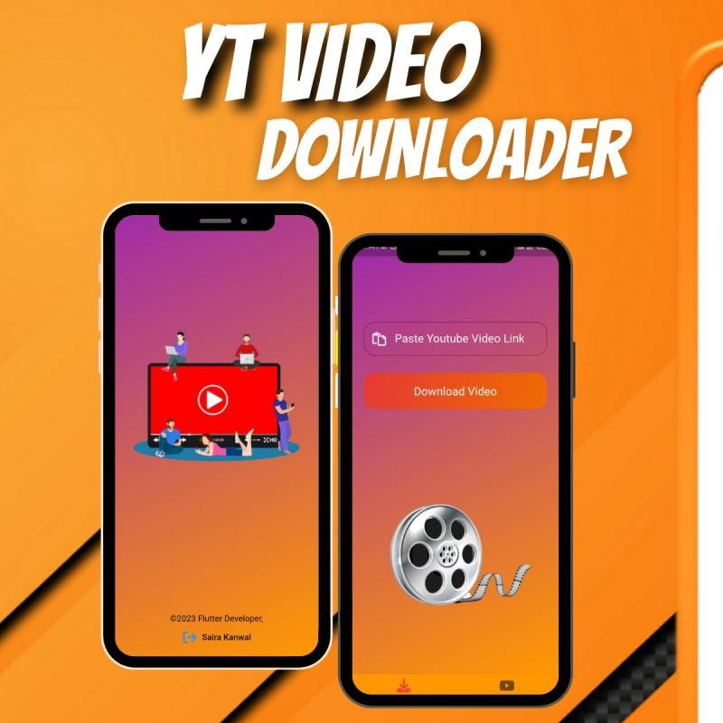

# YouTube Video Downloader App

A **Flutter** application that allows users to download YouTube videos in various formats and resolutions. The app provides a simple and intuitive interface for seamless video downloading.

---

## 📸 Screenshots

---

## ✨ Features

- 🔍 Search for YouTube videos
- 📥 Download videos in multiple resolutions (e.g., 360p, 720p, 1080p)
- 🎵 Extract and download audio in MP3 format
- 📂 Manage downloaded videos
- ⚡ Fast and user-friendly interface
- 🌍 Works with most YouTube links

---

## 🛠️ Technologies Used

- **Flutter** (Dart)
- **YouTube API** (for fetching video details)
- 
---

## ⚠️ Disclaimer

This app is for **personal use only**. Downloading YouTube videos may violate YouTube's terms of service. Please ensure that you have permission before downloading any content.

---

## 📜 License

This project is **open-source** and available under the [MIT License](LICENSE).

---

## 🤝 Contributing

Contributions are welcome! If you'd like to improve the app, feel free to **fork** the repository and submit a **pull request**.

---

## 📧 Contact

For any inquiries or suggestions, reach out via:
- **GitHub**: [saira-kanwal](https://github.com/saira-kanwal)

---

### ⭐ Don't forget to star the repo if you like this project! ⭐

